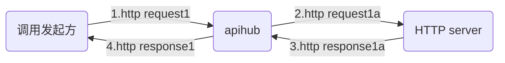
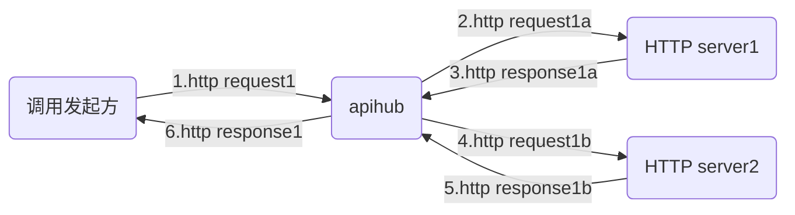
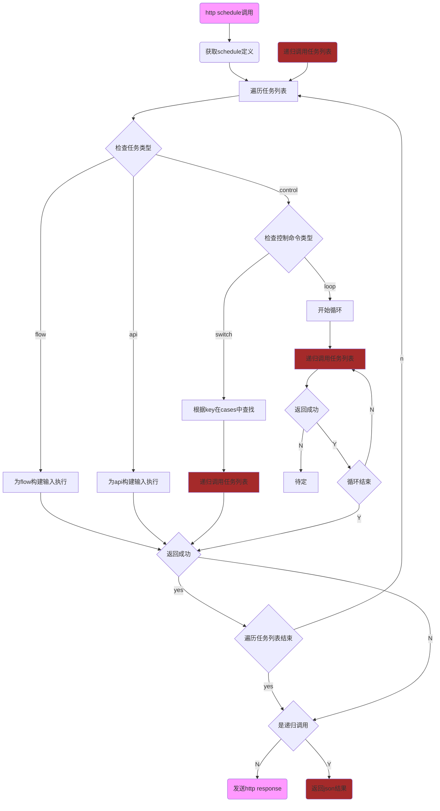

# 特性
APIHUB是一款基于 Golang 开发的微服务网关，能够实现基于JSON定义的灵活的编排能力和高性能 HTTP API的转发能力。   
未来可以对接低代码平台，大大简化对API调用的管理。
# 流程说明
## 前序检查流程
前置检查功能不是本项目重点，暂未实现，只做参考用
```flow
st=>start: http request
e1=>end: 计费统计
e2=>end: 统计

op0=>operation: 调用schedule/flow/api
op0a=>operation: 从输入http body中的JSON提取UUID作为后续log，计费的关键字
op1=>operation: 生成http response
op2=>operation: 发送http response 结果
op3=>operation: 发送http response 错误
 
c0=>condition: 检查header中的时间戳
c1=>condition: 从query获取app id
c2=>condition: 获取app key
c3=>condition: 验证header中的checksum
c4=>condition: 检查API健康
c5=>condition: 计费检查
c6=>condition: 限速检查
c7=>condition: 返回结果2xx

st->c0(yes)->c1(yes)->c2(yes)->c3(yes)->c4(yes)->c5(yes)->c6(yes)->op0a->op0->c7(yes)->op1->op2->e1
c0(no)->op3
c1(no)->op3
c2(no)->op3
c3(no)->op3
c4(no)->op3
c5(no)->op3
c6(no)->op3
c7(no)->op3
op3->e2
```
## API调用流程

API是指根据输入http request生成为新的http request，然后根据返回的http response，并生成新的http response，并发送回调用方。
只支持回应报文为json格式。
```flow
st=>start: api.Run
e1=>end: 返回结果(json格式)
e2=>end: 返回http错误码

c0=>condition: 检查调用的API健康度
c1=>condition: 入参有效性检查
c2=>condition: private秘钥
c3=>condition: 有value
c4=>condition: 有timeout配置
c5=>condition: http response OK
c6=>condition: 有重试
c7=>condition: 超过重试次数
c8=>condition: 需要改写http response
c9=>condition: 遍历结束

opa=>operation: 获取api定义
op0=>operation: 设置HTTP method
op1=>operation: 设置HTTP content type
op2=>operation: 载入秘钥信息
op3=>operation: 遍历parameters列表
op4=>operation: 根据from生成value
op5=>operation: 根据in设置到发送的http报文的相应位置
op6=>operation: 设置http request timeout
op7=>operation: 将最终报文发送到url
op8=>operation: 改写http response

st->opa->c0(yes)->c1(yes)->c2(no)->op3->c3(yes,right)->op5->c9(yes)->c4(yes)->op6->op7->c5(yes)->c8(no)->e1
c9(no)->op3
c0(no)->e2
c1(no)->e2
c2(yes)->op2->op3
c3(no)->op4->op5
c4(no)->op7
c5(no)->c6(yes,right)->c7(yes)->e2
c7(no)->op7
c6(no)->e2
c8(yes)->op8->e1
```
## flow调用流程

flow是将一组API进行串行调用，并且后续API可以使用前序API的返回结果。
```flow
st=>start: flow.Run
e1=>end: 返回结果(json格式)
e2=>end: 返回http错误码

c0=>condition: 检查调用的API健康度
c1=>condition: 入参有效性检查
c参数=>condition: 有api.parameters
c参数结束=>condition: 遍历api.parameters结束
c成功=>condition: API返回成功
cresultKey=>condition: 有resultKey
cstep结束=>condition: 遍历steps结束
capi=>condition: 有api字段
cResponse=>condition: 有Response字段

op定义=>operation: 获取flow定义
op遍历=>operation: 遍历steps列表
op查找=>operation: 根据api.id查找api定义
op遍历参数=>operation: parameters
op执行=>operation: 执行api
op遍历参数=>operation: 遍历api.parameters
op生成入参=>operation: 生成API的入参
op存入结果=>operation: 将返回的json存入StepResult
op改写=>operation: 生成一个新的response

st->op定义->c0(yes)->c1(yes)->op遍历->op查找->capi(yes)->c参数(yes)->op遍历参数->op生成入参->c参数结束(yes)->op执行->c成功(yes)->cresultKey(yes)->op存入结果->cstep结束(yes)->e1
c0(no)->e2
c1(no)->e2
c参数结束(no)->op遍历参数
c参数(no)->op执行
c成功(no)->e2
cstep结束(no)->op遍历
cresultKey(no)->cstep结束
capi(no, right)->cResponse(yes)->op改写->cresultKey
cResponse(no)->cresultKey
```
## schedule调用流程

# 启动

## 环境变量

| 环境变量              | 用途                             | 默认值  |
| --------------------- | -------------------------------- | ------- |
| TGAH_HOST             | 服务的主机名                     | 0.0.0.0 |
| TGAH_PORT             | 服务的端口号                     | 8080    |
| TGAH_BUCKET_ENABLE    | API 和 FLOW 是否按 bucket 隔离   | no      |
| TGAH_API_DEF_PATH     | API 定义文件存放位置             | -       |
| TGAH_FLOW_DEF_PATH    | 编排定义文件存放位置             | -       |
| TGAH_PRIVATE_DEF_PATH | API 定义中使用的私有数据存放位置 | -       |

## 命令行

通过`--env`指定使用的环境变量文件。

```
run go . --env envfile
```

```
run build -o tms-gah-broker
```

```
./tms-gah-broker --env envfile
```

## docker

```
docker build -t tms/gah-broker .
```

```
docker run -it --rm --name tms-gah-broker -p 8080:8080 tms/gah-broker sh
```

```
docker compose build tms-gah-broker
```

```
docker compose up tms-gah-broker
```

## 安装插件

将插件代码复制到容器中

```
docker cp plugins tms-gah-broker:/home/tms-gah/plugins
```

进入容器编译插件

```
docker exec -it tms-go-broker sh
```

```
cd plugins
cd kdxfnlp
go build -buildmode=plugin -o kdxfnlp.so kdxfnlp.go
```

# 基础
建议所有输入，输出参数都定义为非嵌套的JSON格式，方便引用。

## API
建议所有template，func中使用的参数，都独立定义在parameters中，并使用origin，便于在FLOW中从stepResult中取值后传入。

| 字段          | 用途                                                                                                  | 类型     | 必选 |
| ------------- | ----------------------------------------------------------------------------------------------------- | -------- | ---- |
| id            | API 定义的标识。                                                                                      | string   | 是   |
| url           | API 的目标地址。不包括任何查询参数。                                                                  | string   | 是   |
| private       | API 秘钥文件名。                                                                                      | string   | 是   |
| description   | API 的描述。                                                                                          | string   |      |
| method        | HTTP 请求方法，支持`POST`和`GET`。                                                                    | string   | 是   |
|requestContentType | json映射为`application/json`，form映射为`application/x-www-form-urlencoded`，origin为取输入报文的ContentType，并直接转发输入报文的http body，none表示没有body,其他值则直接写入ContentType|string |是|
|               |                                                                                                       |          |      |
| parameters    | HTTP 请求的参数。                                                                                     | string[] |      |
| --in          | 参数位置。支持`query`，`header`,`body`, `vars`。前三者的值除了会放到发送报文里，还可以在模板通过.vars.访问，vars表示只进入.vars问，                                                             | string   | 是   |
| --name        | 参数名称。                                                                                            | string   | 是   |
| --value       | 固定值，当不存在固定值时，则从下面的from获取。                                                                                            | string   | 否   |
| --from        | 指定参数值的获取位置。                                                                                | object   | 否   |
| ----from      | 获取参数值的位置,支持`query`,`header`,`private`(从秘钥文件读取),`origin`(原始报文body中的json),StepResult(从原始报文和处理结果获取)，JsonTemplate(根据template生成json格式的内容)，template(跟据template生成),`func`(hub.FuncMap内部定义函数的名称)。               |          |      |
| ----name      | 参数值所在位置的名称，或者参数所调用函数的名称，或者template的内容。                                                                                |          |      |
| ----args      | 参数值需要调用的func的输入参数，多个参数时，以空格间隔(同级别的from为func时才生效)。例如："args": "apikey X-CurTime X-Param"                                                                                | string         |   否   |
| ----template  | JsonTemplate的输入值,支持.origin.访问输入json，.vars.访问在parameters定义的值，支持采用template的FuncMap的方式直接调用hub.FuncMapForTemplate内部定义的函数(例如"template": "{{md5CheckSumTemplate .vars.apikey .vars.XCurTime .vars.XParam}}")，切记入参若含有字符-，则需要用vars转换参数名。                                                                                |          |      |
|               |                                                                                                       |          |      |
| response      | 返回给调用方的内容。返回的内容统一为`application/json`格式。如果不指定，直接转发目标 API 返回的内容。 | object   | 否   |
| --json        | 返回调用方内容的模板（mustache），数组或对象。支持从被调用方返回的结果进行映射。                      | any      | 是   |
|               |                                                                                                       |          |      |
| plugins       | 支持通过`plugin`对 API 定义进行改写。                                                                 | object[] | 否   |
| --path        | 插件文件的路径。                                                                                      | string   | 是   |

目前系统并未使用`id`字段定位选择的 API，而是根据指定 API 定义文件的名称。

## FLOW

| 字段           | 用途                                                                                                                                     | 类型     | 必选 |
| -------------- | ---------------------------------------------------------------------------------------------------------------------------------------- | -------- | ---- |
| name           | FLOW的名称。                                                                                                                       | string   | 是   |
| description    | FLOW的描述。                                                                                                                       | string   | 否   |
| steps          | 调用API的步骤。每个步骤对应 1 个 API 的调用。API 必须是已定义。                                                                       | object[] | 是   |
| --name         | 步骤的名称。                                                                                                                             | string   | 是   |
| --description  | 步骤的描述。                                                                                                                             | string   | 是   |
| --resultKey    | 在上下文中 API 执行结果对应的名称，origin,vars为保留值不可使用。                                                                      | string   | 是   |
| --api          | 步骤对应的 API 定义。                                                                                                                    | object   | 是   |
| ----id         | API 定义的 ID。                                                                                                                          | string   | 是   |
| ----parameters | 放在这里的定义会补充或者覆盖输入报文里的json参数。`from.from`可以指定为`StepResult`，代表从之前执行步骤的结果（和 resultKey）中提取数据。 | object[] | 否   |
|                |                                                                                                                                          |          |      |
| ------name        | 参数名称。                                                                                            | string   | 是   |
| ------value       | 固定值，当不存在固定值时，则从下面的from获取。                                                                                            | string   | 否   |
| ------from        | 指定参数值的获取位置。                                                                                | object   | 否   |
| --------from      | 获取参数值的位置,支持`query`,`header`,`private`(从秘钥文件读取),`origin`(原始报文body中的json),StepResult(从原始报文和处理结果获取)，JsonTemplate(根据template生成json格式的内容)，template(跟据template生成)。               |          |      |
| --------name      | 参数值所在位置的名称，或者template的内容。                                                                                |          |      |
| --------template  | JsonTemplate的输入值,支持.origin.访问输入json，.vars.访问在parameters定义的值。                                                                                |          |      |
|               |                                                                                                       |          |      |
| --response     | 定义返回结果的模板。                                                                                                                     | object   | 否   |
| ----json       | 统一返回 JSON 格式的内容。                                                                                                               | any      | 是   |

# 功能

## 定义和执行 API

需要在 API 定义存放目录中存在`{apiId}.json`文件。每个 API 定义对应一个文件，文件名（不含扩展名`.json`）必须和 API 定义的 ID 一致。

需要通过环境变量`TGAH_API_DEF_PATH`指定定义文件存放位置。

通过路由`/api/{apiId}`调用指定的 API。例如：

```
curl -H "Content-Type: application/json" -d '{"city": "北京"}' "http://localhost:8080/api/amap_district"
```

## 定义和执行调用流 FLOW

需要通过环境变量`TGAH_FLOW_DEF_PATH`指定定义文件存放位置。每个 FLOW 定义对应一个文件，文件名（不含扩展名`.json`）必须和 API 定义的 ID 一致。

通过路由`/flow/{flowId}`调用指定的 FLOW。例如：

```
curl -H "Content-Type: application/json" -d '{"city": "北京"}' "http://localhost:8080/flow/amap_city_weather"
```

## 数据转换模板

待补充

# 插件

插件需要在与主程序相同的环境进行编译。

# 隔离

使用`bucket`进行数据隔离。

# 开发计划
## 近期
* 支持WHILE循环命令
* 支持func获取value
    * 支持无输入参数 utc，uuid   
    * 支持有输入参数 md5sum，timeStamp，base64，base64 decode
    * 支持template使用func（FuncMap）
    * 支持从.so动态注册函数
* json文件load一次，反复使用
* 支持返回json之外的http response
* 支持token缓存
## 中期
* 支持在http response中访问origin中的值
* 开发测试http server，postman或者apifox的测试脚本
* 在JSON，HTTP处理错误时能够返回HTTP错误给调用方
* 支持http请求retry，timeout
* 增加plugin框架，并支持Prometheus，本地log，本地file log，基于kafka的JSON输出
## 任务池
* 暴露管理API，动态日志等级
* 支持单API并发限制，令牌桶限制
* 支持对private文件秘钥加解密
* 支持在parameters中引用之前的http错误码
* 性能提升，使用fasthttp，fastjson/json-iterator等
* 支持json文件动态下载并reload（全更新）
* go async pool
* graceful shutdown
* 参数有效性检查
* 支持异步，循环加异步
## 需要考虑
* Opentracing，Skywalking
* 多SSL证书
* 熔断，降级
* API健康检查
* 支持API调用websocket，gRPC，Dubbo
* 支持HTTP->kafka
* Open API ：支持使用open api配置网关
* URL Scheme
* 是否考虑集成进
    * https://github.com/go-kratos/kratos
    * https://github.com/eolinker/apinto

## 已经完成：
* 支持从远端http下载压缩包，解压作为conf，支持压缩包密码
# 参考

[OpenAPI Specification](https://swagger.io/specification/)

https://netflix.github.io/conductor/configuration/workflowdef/


