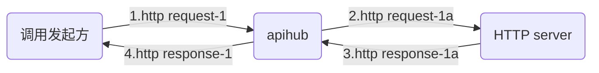
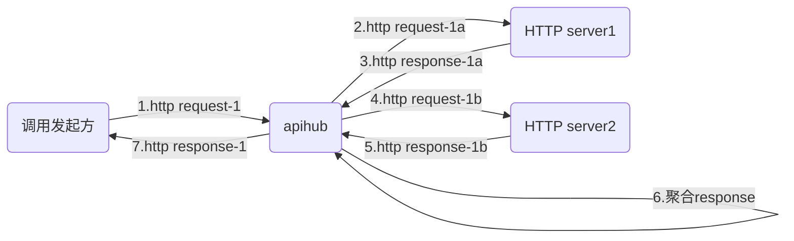
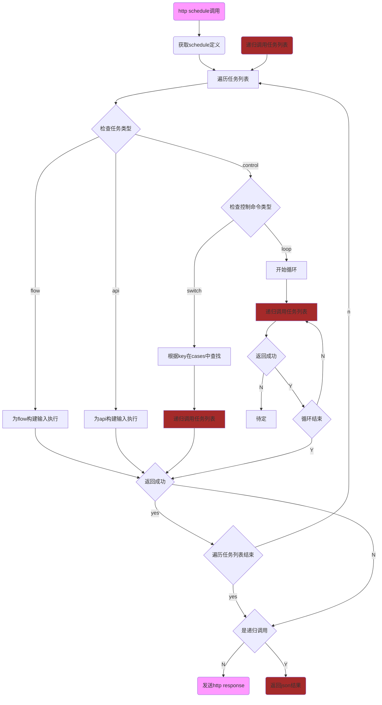

# 特性
APIHUB是一款基于 Golang 开发的微服务网关，能够实现基于JSON定义的灵活的编排能力和高性能 HTTP API的转发能力。   
未来可以对接低代码平台，大大简化对API调用的管理。
# 流程说明
## 前序检查流程
前置检查功能不是本项目重点，暂未实现，只做参考用
```flow
st=>start: http request
e1=>end: 计费统计
e2=>end: 统计

op0=>operation: 调用schedule/flow/api
op0a=>operation: 从输入http body中的JSON提取UUID作为后续log，计费的关键字
op1=>operation: 生成http response
op2=>operation: 发送http response 结果
op3=>operation: 发送http response 错误
 
c0=>condition: 检查header中的时间戳
c1=>condition: 从query获取app id
c2=>condition: 获取app key
c3=>condition: 验证header中的checksum
c4=>condition: 检查API健康
c5=>condition: 计费检查
c6=>condition: 限速检查
c7=>condition: 返回结果2xx

st->c0(yes)->c1(yes)->c2(yes)->c3(yes)->c4(yes)->c5(yes)->c6(yes)->op0a->op0->c7(yes)->op1->op2->e1
c0(no)->op3
c1(no)->op3
c2(no)->op3
c3(no)->op3
c4(no)->op3
c5(no)->op3
c6(no)->op3
c7(no)->op3
op3->e2
```
## API调用流程

API是指根据输入http request生成新的http request(注意不是改写原http request)，然后根据返回的http response，生成新的http response，发送回调用方。
只支持回应报文为json格式。
```flow
st=>start: api.Run
e1=>end: 返回结果(json格式)
e2=>end: 返回http错误码

c0=>condition: 检查调用的API健康度
c1=>condition: 入参有效性检查
c2=>condition: private秘钥
c3=>condition: 有value
c4=>condition: 有timeout配置
c5=>condition: http response OK
c6=>condition: 有重试
c7=>condition: 超过重试次数
c8=>condition: 需要改写http response
c9=>condition: 遍历结束
c10=>condition: 检查是否支持缓存Cache
c11=>condition: 检查缓存Cache是否过期
c12=>condition: 解析过期时间正确
c13=>condition: 支持缓存Cache
c14=>condition: 报文是否需要errcode检查
c15=>condition: 报文中errcode是否成功

opa=>operation: 获取api定义
op0=>operation: 设置HTTP method
op1=>operation: 设置HTTP content type
op2=>operation: 载入秘钥信息
op3=>operation: 遍历parameters列表
op4=>operation: 根据from生成value
op5=>operation: 根据in设置到发送的http报文的相应位置
op6=>operation: 设置http request timeout
op7=>operation: 将最终报文发送到url
op8=>operation: 改写http response
op9=>operation: 读取缓存Cache报文
op10=>operation: 解析报文过期时间
op11=>operation: 缓存记录http response报文
op12=>operation: 记录回复报文body
op13=>operation: 解析报文中errcode

st->opa->c10(yes)->c11(yes)->c0(yes)->c1(yes)->c2(no)->op3->c3(yes,right)->op5->c9(yes)->c4(yes)->op6->op7->c5(yes)->op12->c14(yes)->c15(yes)->c8(no)->c13(yes)->op10->c12(yes)->op11->e1
c9(no)->op3
c0(no)->e2
c1(no)->e2
c2(yes)->op2->op3
c3(no)->op4->op5
c4(no)->op7
c5(no)->c6(yes,right)->c7(yes)->e2
c7(no)->op7
c6(no)->e2
c8(yes)->op8->c13
c10(no)->c0
c11(no)->op9->e1
c12(no)->e1
c13(no)->e1
c14(no)->c8
c15(no)->e2

```
## flow调用流程

flow是处理一组API调用（支持串线/并行/并行串行交替），并且后续串行API可以使用前序API的返回结果，也支持将多个API的返回结果聚合成一个http response。
```flow
st=>start: flow.Run
e1=>end: 返回结果(json或HTML)

c0=>condition: 检查调用的API健康度
c1=>condition: 入参有效性检查
c并行=>condition: concurrentNum>1
c并行1=>condition: concurrentNum>1
c并行T=>condition: concurrent==true
cstep结束=>condition: 遍历steps结束

op定义=>operation: 获取flow定义
op协程=>operation: 创建协程
op协程执行=>operation: 在协程中执行API
op协程等待1=>operation: 等待所有并行API结束
op协程等待2=>operation: 等待所有并行API结束
op遍历=>operation: 遍历steps列表
op执行=>operation: 串行执行API

st->op定义->c0(yes)->c1(yes)->c并行(yes)->op协程->op遍历->c并行1(no,down)->op执行->cstep结束(yes)->op协程等待1->e1
c并行(no)->op遍历
c并行1(yes,right)->c并行T(yes,right)->op协程执行->cstep结束
cstep结束(no)->op遍历
c并行T(no,down)->op协程等待2(left)->op执行->cstep结束

```
单个API执行过程
```flow
st=>start: 根据api.id查找api定义
e1=>end: 返回结果(json或HTML)
e2=>end: 返回http错误码
e3=>end: 将结果返回主协程

op查找=>operation: 根据api.id查找api定义
op遍历参数=>operation: parameters
op执行=>operation: 执行api
op遍历参数=>operation: 遍历api.parameters
op生成入参=>operation: 生成API的入参
op存入结果=>operation: 将返回的json存入StepResult
op改写=>operation: 生成一个新的response
op记录文本格式=>operation: 记录返回的文本格式

c参数=>condition: 有api.parameters
c参数结束=>condition: 遍历api.parameters结束
c成功=>condition: API返回成功
cresultKey=>condition: 有resultKey
c并行=>condition: concurrent==true

capi=>condition: 有api字段
cResponse=>condition: 有Response字段

op查找->capi(yes)->c参数(yes)->op遍历参数->op生成入参->c参数结束(yes)->op执行->c成功(yes)->c并行(no)->cresultKey(yes)->op存入结果->op记录文本格式->e1
c成功(no)->e2
c参数结束(no)->op遍历参数
c参数(no)->op执行
cresultKey(no)->e1
c并行(yes)->e3

```
## schedule调用流程
schedule封装了两种控制命令switch/case和loop，并且能够调用底层的flow和api.

类似flow的并行，schedule也支持上述四种命令的并行执行。建议不要在schedule层次嵌套使用多层并行，未进行相关测试。
loop循环支持多个条目并行执行，可以和上面的并行嵌套。

由于schedule的并行逻辑和flow的并行逻辑基本相同（并行API的结果会在所有并行API都执行后写入stepResult;在执行串行API之前，会等到所有并行API执行结束），下图中只描述了串行流程，没有并行相关逻辑。

# 启动

## 环境变量

| 环境变量                      | 用途                                                         | 默认值  |
| ----------------------------- | ------------------------------------------------------------ | ------- |
| TGAH_HOST                     | 服务的主机名                                                 | 0.0.0.0 |
| TGAH_PORT                     | 服务的端口号                                                 | 8080    |
| TGAH_BUCKET_ENABLE            | API 和 FLOW 是否按 bucket 隔离                               | no      |
| TGAH_API_DEF_PATH             | API 定义文件存放位置                                         | .conf/apis       |
| TGAH_FLOW_DEF_PATH            | 编排定义文件存放位置                                         | .conf/flows       |
| TGAH_PRIVATE_DEF_PATH         | API 定义中使用的私有数据存放位置                             | .conf/privates       |
| TGAH_PLUGIN_DEF_PATH          | plugins 定义中使用的外部动态库存放位置                       | .conf/plugins       |
| TGAH_REMOTE_CONF_URL          | 从远端http服务器下载conf压缩包的路径，未配置则不下载，直接使用本地文件                         | -       |
| TGAH_REMOTE_CONF_STORE_FOLDER | 下载文件解压的目录                                           | ./conf  |
| TGAH_REMOTE_CONF_UNZIP_PWD    | 下载文件解压密码，如果有密码则写解压密码，如果没有则不填     | -       |

## 命令行

通过`--env`指定使用的环境变量文件。

```
run go . --env envfile
```

```
run build -o tms-gah-broker
```

```
./tms-gah-broker --env envfile
```

## docker

```
docker build -t tms/gah-broker .
```

```
docker run -it --rm --name tms-gah-broker -p 8080:8080 tms/gah-broker sh
```

```
docker compose build tms-gah-broker
```

```
docker compose up tms-gah-broker
```

## 安装插件
插件编译不依赖于本代码。

```
cd plugins
cd kdxfnlp
go build -buildmode=plugin -o kdxfnlp.so kdxfnlp.go
```
将生成的.so放到conf/plugins下，模块启动时候会自动加载

# JSON定义
## PRIVATE
| 字段           | 用途                                                                                                                                     | 类型     | 必选 |
| -------------- | ---------------------------------------------------------------------------------------------------------------------------------------- | -------- | ---- |
| name           | private名称称。                                                                                                                       | string   | 是   |
| value    | private值。                                                                                                                       | string   | 否   |

## API
建议所有需要从template，func中传入的参数，都独立定义在parameter中，并使用origin。

| 字段          | 用途                                                                                                  | 类型     | 必选 |
| ------------- | ----------------------------------------------------------------------------------------------------- | -------- | ---- |
| id            | API 定义的标识。                                                                                      | string   | 是   |
| url           | API 的目标地址。不包括任何查询参数。                                                                  | string   | 否   |
| dynamicUrl    | 当url为空时，必须提供这个结构，用来动态生成URL（比如路径中含有appId），结构为下面的from。不包括任何查询参数。    | object   | 否   |
| private       | API 秘钥文件名。                                                                                      | string   | 否   |
| description   | API 的描述。                                                                                          | string   |  否    |
| method        | HTTP 请求方法，支持`POST`和`GET`。                                                                    | string   | 是   |
|requestContentType | json映射为`application/json`，form映射为`application/x-www-form-urlencoded`，origin为取输入报文的ContentType，并直接转发输入报文的http body，none表示没有body,其他值则直接写入ContentType|string |是|
|               |                                                                                                       |          |      |
| parameters    | HTTP 请求的参数。                                                                                     | object[] |    否  |
| --in          | 参数位置。支持`query`，`header`,`body`, `vars`。前三者的值除了会放到发送报文里，还可以在模板通过.vars.访问，vars表示只进入.vars| string| 是   |
| --name        | 参数名称。                                                                                            | string   | 是   |
| --value       | 固定值，当不存在固定值时，则从下面的from获取。     | string   | 否   |
| --from        | 指定参数值的获取位置。             | object   | 否   |
| ----from      | 获取参数值的位置,支持`query`,`header`,`private`(从秘钥文件读取),`origin`(原始报文body中的json),StepResult(从原始报文和处理结果获取)，JsonTemplate(根据template生成json格式的内容)，template(跟据template生成),`func`(hub.FuncMap内部定义函数的名称)。               |     string     |  是    |
| ----name      | 参数名称，或者函数名称，或者template的内容。                 |     string     | 否     |
| ----args      | from为func时，func的输入参数，多个参数时需要以空格分割，如："args": "apikey X-CurTime X-Param"                 | string         |   否   |
| ----template  | JsonTemplate的输入值,支持.origin.访问输入json，.vars.访问在parameters定义的值，支持采用template的FuncMap的方式直接调用hub.FuncMapForTemplate内部定义的函数(例如"template": "{{md5 .vars.apikey .vars.XCurTime .vars.XParam}}")。如果入参名字含有字符-，则需要定义一个新的vars，去掉原名字中的-|    object      |  否    |
|               |                                                                                                       |          |      |
| response      | 返回给调用方的内容。返回的内容统一为`application/json`格式。如果不指定，直接转发目标 API 返回的内容。 | object   | 否   |
| --json        | 返回调用方内容的模板（mustache），数组或对象。支持从被调用方返回的结果进行映射。                      | any      | 是   |
|               |                                                                                                       |          |      |
| cache | HTTP请求是否支持缓存模式，如果支持，在过期时间内，将不会再向服务器请求，而是直接返回缓存内容。 | object | 否 |
| --format | 指定过期时间的解析格式。分为秒“second”和具体时间格式，如：“20060102150405” | string | 是 |
| --from | 指定过期时间的获取位置。 | object | 是 |
| ----from | 获取过期时间的位置，是从header域中获取的话，则设置为“header”，如果从body中获取，则设置为“template” | string | 是 |
| ----name | 过期时间域的名称，或者template的内容。 | string | 是 |
|          |                                        |        |    |
| respStatus | 指定回应body体中的状态码 | object | 否 |
| --from | 指定状态码的获取位置，同上面的from。 | object | 是 |
| --format | 指定状态码的解析格式。分为数字“number”和string | string | 是 |
| --expected | 状态码的期望正确值 | string | 是 |


目前系统并未使用`id`字段定位选择的 API，而是根据指定 API 定义文件的名称。

## FLOW

| 字段           | 用途                                                                                                                                     | 类型     | 必选 |
| -------------- | ---------------------------------------------------------------------------------------------------------------------------------------- | -------- | ---- |
| name           | FLOW的名称。| string   | 是   |
| description    | FLOW的描述。| string   | 否   |
| concurrentNum           | 最大允许的并行执行的数量。| int   | 否   |
| steps          | 调用API的步骤。每个步骤对应 1 个 API 的调用。API 必须是已定义。   | object[] | 是   |
| --name         | 步骤的名称。          | string   | 是   |
| --description  | 步骤的描述。       | string   | 否   |
| --resultKey    | 在上下文中 API 执行结果对应的名称，origin,vars,result,loop为保留值不可使用。      | string   | 否   |
| --concurrent   | 是否使用并行执行。                       | bool   | 否   |
| --api          | 步骤对应的 API 定义。                                    | object   | 是   |
| ----private    | 用于覆盖原始API中的private。                            | string   | 否   |
| ----id         | API 定义的 ID。                            | string   | 是   |
| ----parameters | 放在这里的定义会补充或者覆盖输入报文里的json参数。`from.from`可以指定为`StepResult`，代表从之前执行步骤的结果（和 resultKey）中提取数据。 | object[] | 否   |
|                |          |      ||
| ------name        | 参数名称。                          | string   | 是   |
| ------value       | 固定值，当不存在固定值时，则从下面的from获取。                       | string   | 否   |
| ------from        | 指定参数值的获取位置。                               | object   | 否   |
| --------from      | 获取参数值的位置,支持`query`,`header`,`private`(从秘钥文件读取),`origin`(原始报文body中的json),StepResult(从原始报文和处理结果获取)，JsonTemplate(根据template生成json格式的内容)，template(跟据template生成)。               |          |      |
| --------name      | 参数值所在位置的名称，或者template的内容。             |          |      |
| --------template  | JsonTemplate的输入值,支持.origin.访问输入json，.vars.访问在parameters定义的值。      |      |      |
|               |              |          |      |
| --response     | 定义返回结果的模板。                                      | object   | 否   |
| ----type   | 返回什么格式的内容，json或者html。                                       | string      | 是   |
| ----from | 返回的内容或者template定义 | object | 否 |

## SCHEDULE
| 字段          | 用途                                                                                                  | 类型     | 必选 |
| ------------- | ----------------------------------------------------------------------------------------------------- | -------- | ---- |
| name            | SCHEDULE 定义的标识。                                         | string   | 是   |
| description   | SCHEDULE 的描述。                        | string   |  否    |
| concurrentNum           | 最大允许的并行执行的数量。                               | int   | 否   |
|          |      |
| tasks    | 任务列表。                                object[] |      |
| --type          | control，api, flow| string   | 是   |
| --name          | type为api, flow时，为对应的名字，control时可以是switch，loop| string   | 是   |
|--description   | task 的描述。      | string   |  否    |
|--resultKey   |  在API或者FLOW 执行结果对应的名称，在loop时将索引保存在.loop.resultKey,便于后续引用(如{{index .origin.cities .loop.myloop}}), origin,vars,result,loop为保留值不可使用。      | string   |  否    |
|--key   |  switch时为要检查的值，loop时为循环的次数，同FLOW里的from。      | object   |  否    |
|--concurrentNum   |  control命令时最大允许的并行执行的数量。      | int   |  否    |
| --concurrent   | 是否使用并行执行。                       | bool   | 否   |
| --tasks   | control命令时的执行列表，结构同上层的tasks，为tasks的自身嵌套。                       | object[]   | 否   |
| --parameters   | flow和control时用于改写origin，同flow的parameters。        | object[]   | 否   |
| --private    | 用于覆盖原始API中的private。                            | string   | 否   | 
| --cases   | switch时检查的case。                       | object[]   | 否   |
| ----Value   | 上层的key等于本字段则执行tasks。                       | string   | 是   |
| ----concurrentNum   |  control命令时最大允许的并行执行的数量。      | int   |  否    |
| --tasks   | 结构同上层的tasks，为tasks的自身嵌套。                       | object[]   | 否   |

# 功能
## 定义和执行 API

需要在 API 定义存放目录中存在`{apiId}.json`文件。每个 API 定义对应一个文件，文件名（不含扩展名`.json`）必须和 API 定义的 ID 一致。

需要通过环境变量`TGAH_API_DEF_PATH`指定定义文件存放位置。

通过路由`/api/{apiId}`调用指定的 API。例如：

```
curl -H "Content-Type: application/json" -d '{"city": "北京"}' "http://localhost:8080/api/amap_district"
```

## 定义和执行 FLOW

需要通过环境变量`TGAH_FLOW_DEF_PATH`指定定义文件存放位置。每个 FLOW 定义对应一个文件，文件名（不含扩展名`.json`）必须和 FLOW 定义的 ID 一致。

通过路由`/flow/{flowId}`调用指定的 FLOW。例如：

```
curl -H "Content-Type: application/json" -d '{"city": "北京"}' "http://localhost:8080/flow/amap_city_weather"
```
## 定义和执行 SCHEDULE

需要通过环境变量`TGAH_SCHEDULE_DEF_PATH`指定定义文件存放位置。每个 SCHEDULE 定义对应一个文件，文件名（不含扩展名`.json`）必须和 SCHEDULE 定义的 ID 一致。

通过路由`/schedule/{scheduleId}`调用指定的 FLOW。例如：

```
curl  -H "Content-Type: application/json" -d '{"cities":["sh", "bj", "sh", "sh"], "image":"https://img.zcool.cn/community/01ff2059770a25a8012193a37c7695.jpg"}' "http://localhost:8080/schedule/amap_qywx"
```

# 插件
插件主要用于注册用户私有的func，可以不编译到主程序中。

程序启动会导入环境变量`TGAH_PLUGIN_DEF_PATH`制定的目录下以及子目录下所有的.so插件，将插件提供的函数载入hub.FuncMap和hub.FuncMapForTemplate
插件不需要在与主程序相同的环境进行编译，但.so插件需要定义接口函数:
func Register() (map[string](interface{}), map[string](interface{}))，其中第一个map将指定载入hub.FuncMap，第二个map将载入hub.FuncMapForTemplate使用


# 隔离

使用`bucket`进行数据隔离。

# 开发计划
## 近期
* 支持返回非json格式的http response
* json schema
* 开发测试http server，postman或者apifox的测试脚本
* api version
## 中期
* 对输入数组的支持
* 支持switch default case
* 支持load API时候，检验private信息，load FLOW时候，检验API信息，load schedule时候，检验FLOW和API
* 支持在http response中访问origin中的值
* 在JSON，HTTP处理错误时能够返回HTTP错误给调用方
* 支持http请求retry，timeout
 **"timeoutPolicy": "TIME_OUT_WF",
 **"retryLogic": "FIXED",
 **"retryDelaySeconds": 600,
 **"responseTimeoutSeconds": 3600
* 增加plugin框架，并支持Prometheus，本地log，本地file log，基于kafka的JSON输出
## 任务池
* 暴露管理API，动态日志等级
* 支持单API并发限制，令牌桶限制
* 支持对private文件秘钥加解密
* 支持在parameters中引用之前的http错误码
* 性能提升，使用fasthttp，fastjson/json-iterator等
* 支持json文件动态下载并reload（全更新）
* go async pool
* graceful shutdown
* 参数有效性检查
* 支持异步，循环加异步
* 支持基于user的private
## 需要考虑
* Opentracing，Skywalking
* 多SSL证书
* 熔断，降级
* API健康检查
* 支持API调用websocket，gRPC，Dubbo，redis，kafka
* Open API ：支持使用open api配置网关
* URL Scheme
* 是否考虑集成进
    * https://github.com/go-kratos/kratos
    * https://github.com/eolinker/apinto

## 已经完成：
* 支持从远端http下载压缩包，解压作为conf，支持压缩包密码
* json文件load一次，反复使用
* json文件合法性检查
* 支持SWITCH/loop循环命令
* 支持loop并发调用
* 支持flow，schedule，loop并发调用
* 支持func获取value
    * 支持无输入参数 utc 
    * 支持有输入参数 md5
    * 支持template使用func（FuncMap）
    * 支持从.so动态注册函数
* 支持token缓存
* 支持flow覆盖api中的private
* 支持在url中使用private
* 支持200OK + error code转错误码
# 参考

[OpenAPI Specification](https://swagger.io/specification/)

https://netflix.github.io/conductor/configuration/workflowdef/
https://states-language.net/spec.html
