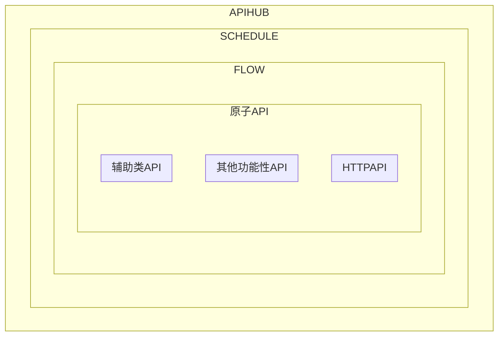
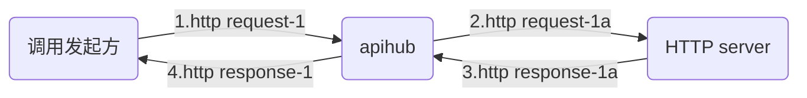
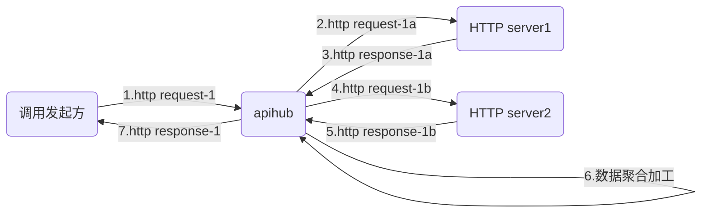
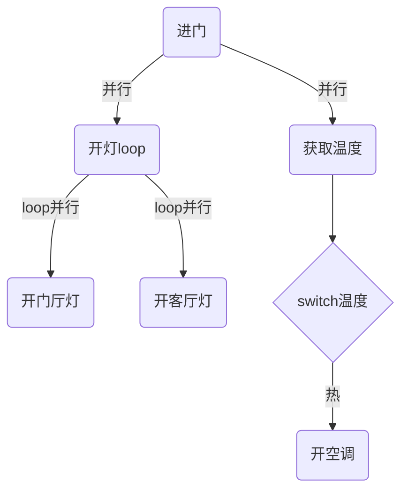

API泛指一切功能，甚至APIHUB本身也是通过API启动的一个FLOW。
API的主要功能是根据输入数据，进行逻辑处理，然后输出数据。

各个概念之间的包含关系如下

# HTTPAPI

HTTPAPI是指根据输入http request生成全新的http request(注意不是改写原http request)，然后根据返回的http response，生成新的http response，发送给回调用方。
当前只支持回应报文为json格式。

# FLOW

flow是指串行调用一组API，并且可以将其中的每个API的执行结果都进行记录，后续API可以使用之前API的执行结果作为输入参数。
注意其中的API没有任何限定，可以是httpapi，flow，也可以是其他功能性API，比如根据输入的json生成html页面。

注意系统中有些默认flow
| 名称 | 用途 |
| -- | -- |
| _APIGATEWAY_PRE.json | 在API网关中对于每个输入都要执行的操作，包括多租户获取用户名，进行权限检查 |
| _APIGATEWAY_HTTPAPI.json | 在API网关中，对于HTTPAPI的调用，包括调用底层HTTPAPI，进行HTTP response |
| _APIGATEWAY_HTTPAPI.json | 在API网关中，对于HTTPAPI的调用，包括调用底层HTTPAPI，进行HTTP response |
| _APIGATEWAY_POST_OK.json | 在API网关中，对于执行成功的调用，调用此flow，主要用于更新promtheus http_in。注意如果此调用失败，并不会影响原调用，也不会触发_APIGATEWAY_POST_NOK.json。|
| _APIGATEWAY_POST_NOK.json | 在API网关中，对于执行不成功的调用，调用此flow，主要用于更新promtheus http_in和失败通知（如调用企业微信_QYWX_NOTIFY.json）。注意如果此调用失败，并不会影响原调用，也不会触发_APIGATEWAY_POST_NOK.json。|
| _HTTPOK.json | 在对外调用HTTP请求成功后，调用此flow，主要用于更新promtheus http_out |
| _HTTPNOK.json | 在对外调用HTTP请求不成功后，调用此flow，主要用于更新promtheus http_out |
# SCHEDULE
schedule是在FLOW的基础上，支持了了两种控制命令switch/case和loop，并且支持并行执行和loop内并行执行.

注意并行执行的API之间应该没有相互依赖性，即不能将一个并行执行
API的执行结果，作为另一个并行执行API的输入.

并行执行，类似智能家电中，用户进门，同时开灯和根据温度开空调，注意两者的对外接口不一样。
loop内并行执行，是在上个场景中，将家中需要的灯同时都打开，注意所有灯的对外接口一样。

