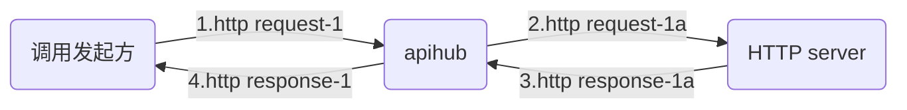
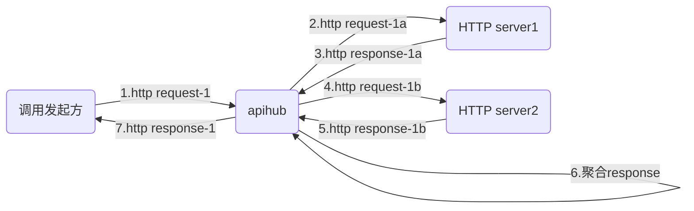
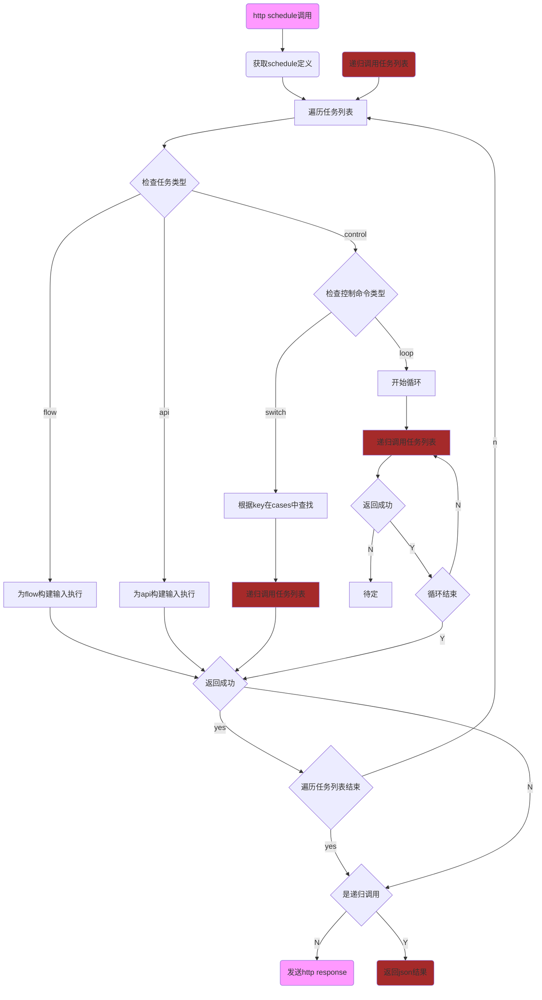

## 前序检查流程
前置检查功能不是本项目重点，暂未实现，只做参考用
```flow
st=>start: http request
e1=>end: 计费统计
e2=>end: 统计

op0=>operation: 调用schedule/flow/api
op0a=>operation: 从输入http body中的JSON提取UUID作为后续log，计费的关键字
op1=>operation: 生成http response
op2=>operation: 发送http response 结果
op3=>operation: 发送http response 错误
 
c0=>condition: 检查header中的时间戳
c1=>condition: 从query获取app id
c2=>condition: 获取app key
c3=>condition: 验证header中的checksum
c4=>condition: 检查API健康
c5=>condition: 计费检查
c6=>condition: 限速检查
c7=>condition: 返回结果2xx

st->c0(yes)->c1(yes)->c2(yes)->c3(yes)->c4(yes)->c5(yes)->c6(yes)->op0a->op0->c7(yes)->op1->op2->e1
c0(no)->op3
c1(no)->op3
c2(no)->op3
c3(no)->op3
c4(no)->op3
c5(no)->op3
c6(no)->op3
c7(no)->op3
op3->e2
```
## API调用流程

API是指根据输入http request生成新的http request(注意不是改写原http request)，然后根据返回的http response，生成新的http response，发送回调用方。
只支持回应报文为json格式。
```flow
st=>start: api.Run
e1=>end: 返回结果(json格式)
e2=>end: 返回http错误码

c0=>condition: 检查调用的API健康度
c1=>condition: 入参有效性检查
c2=>condition: private秘钥
c3=>condition: 有value
c4=>condition: 有timeout配置
c5=>condition: http response OK
c6=>condition: 有重试
c7=>condition: 超过重试次数
c8=>condition: 需要改写http response
c9=>condition: 遍历结束
c10=>condition: 检查是否支持缓存Cache
c11=>condition: 检查缓存Cache是否过期
c12=>condition: 解析过期时间正确
c13=>condition: 支持缓存Cache
c14=>condition: 报文是否需要errcode检查
c15=>condition: 报文中errcode是否成功

opa=>operation: 获取api定义
op0=>operation: 设置HTTP method
op1=>operation: 设置HTTP content type
op2=>operation: 载入秘钥信息
op3=>operation: 遍历parameters列表
op4=>operation: 根据from生成value
op5=>operation: 根据in设置到发送的http报文的相应位置
op6=>operation: 设置http request timeout
op7=>operation: 将最终报文发送到url
op8=>operation: 改写http response
op9=>operation: 读取缓存Cache报文
op10=>operation: 解析报文过期时间
op11=>operation: 缓存记录http response报文
op12=>operation: 记录回复报文body
op13=>operation: 解析报文中errcode

st->opa->c10(yes)->c11(yes)->c0(yes)->c1(yes)->c2(no)->op3->c3(yes,right)->op5->c9(yes)->c4(yes)->op6->op7->c5(yes)->op12->c14(yes)->c15(yes)->c8(no)->c13(yes)->op10->c12(yes)->op11->e1
c9(no)->op3
c0(no)->e2
c1(no)->e2
c2(yes)->op2->op3
c3(no)->op4->op5
c4(no)->op7
c5(no)->c6(yes,right)->c7(yes)->e2
c7(no)->op7
c6(no)->e2
c8(yes)->op8->c13
c10(no)->c0
c11(no)->op9->e1
c12(no)->e1
c13(no)->e1
c14(no)->c8
c15(no)->e2

```
## flow调用流程

flow是处理一组API调用（支持串线/并行/并行串行交替），并且后续串行API可以使用前序API的返回结果，也支持将多个API的返回结果聚合成一个http response。
```flow
st=>start: flow.Run
e1=>end: 返回结果(json或HTML)

c0=>condition: 检查调用的API健康度
c1=>condition: 入参有效性检查
c并行=>condition: concurrentNum>1
c并行1=>condition: concurrentNum>1
c并行T=>condition: concurrent==true
cstep结束=>condition: 遍历steps结束

op定义=>operation: 获取flow定义
op协程=>operation: 创建协程
op协程执行=>operation: 在协程中执行API
op协程等待1=>operation: 等待所有并行API结束
op协程等待2=>operation: 等待所有并行API结束
op遍历=>operation: 遍历steps列表
op执行=>operation: 串行执行API

st->op定义->c0(yes)->c1(yes)->c并行(yes)->op协程->op遍历->c并行1(no,down)->op执行->cstep结束(yes)->op协程等待1->e1
c并行(no)->op遍历
c并行1(yes,right)->c并行T(yes,right)->op协程执行->cstep结束
cstep结束(no)->op遍历
c并行T(no,down)->op协程等待2(left)->op执行->cstep结束

```
单个API执行过程
```flow
st=>start: 根据api.id查找api定义
e1=>end: 返回结果(json或HTML)
e2=>end: 返回http错误码
e3=>end: 将结果返回主协程

op查找=>operation: 根据api.id查找api定义
op遍历参数=>operation: parameters
op执行=>operation: 执行api
op遍历参数=>operation: 遍历api.parameters
op生成入参=>operation: 生成API的入参
op存入结果=>operation: 将返回的json存入StepResult
op改写=>operation: 生成一个新的response
op记录文本格式=>operation: 记录返回的文本格式

c参数=>condition: 有api.parameters
c参数结束=>condition: 遍历api.parameters结束
c成功=>condition: API返回成功
cresultKey=>condition: 有resultKey
c并行=>condition: concurrent==true

capi=>condition: 有api字段
cResponse=>condition: 有Response字段

op查找->capi(yes)->c参数(yes)->op遍历参数->op生成入参->c参数结束(yes)->op执行->c成功(yes)->c并行(no)->cresultKey(yes)->op存入结果->op记录文本格式->e1
c成功(no)->e2
c参数结束(no)->op遍历参数
c参数(no)->op执行
cresultKey(no)->e1
c并行(yes)->e3

```
## schedule调用流程
schedule封装了两种控制命令switch/case和loop，并且能够调用底层的flow和api.

类似flow的并行，schedule也支持上述四种命令的并行执行。建议不要在schedule层次嵌套使用多层并行，未进行相关测试。
loop循环支持多个条目并行执行，可以和上面的并行嵌套。

由于schedule的并行逻辑和flow的并行逻辑基本相同（并行API的结果会在所有并行API都执行后写入stepResult;在执行串行API之前，会等到所有并行API执行结束），下图中只描述了串行流程，没有并行相关逻辑。
